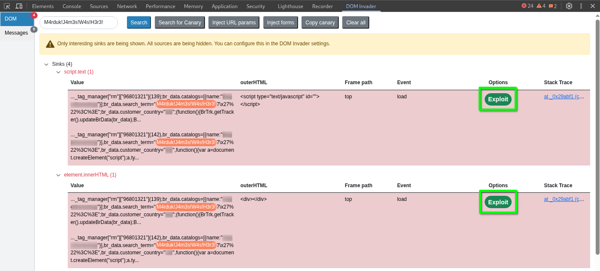
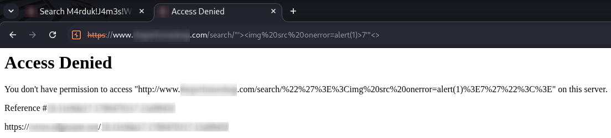

#   DOM Invader on a Real Bug Bounty Target: 10 Sink Hits, 0 Vulnerabilities


If you've been following my previous DOM XSS articles, you may be ready to try your skills against a live bug bounty target. That's where many researchers discover that the techniques are the same, but the environment isn't. Instead of a handful of JavaScript files, you may be dealing with dozens. Instead of a few sink matches, you may find thousands. The challenge quickly becomes separating the handful of interesting results from the overwhelming amount of noise.

##  Real Target Background

I chose a mid-sized e-commerce application participating in a public bug bounty program hosted on [Intigriti](https://www.intigriti.com/). It's not a huge one like Amazon, but still has a lot of products.

Once I had my initial recon running, I visited the site to manually browse around. I noticed it had a search bar, so I used my usual search string: `M4rduk`

The site responded with: `200 results for "M4rduk"`

I tried to narrow that down a little by extending my search string to: `M4rduk!J4m3s!W4s!H3r3!`. Surely there are no matches for that.

Again: `200 results for "M4rduk!J4m3s!W4s!H3r3!"`

OK. Let's dig in to see what's happening. 

The page source contained over 250 reflections of my canary. Too many to track down manually.

DevTools Inspector returned 10 results for my string. Nothing of significance here, so I moved on to look at what I could find in the JavaScript files. All together there were maybe 30 JS files.

I tried a couple of searches:
- `M4rduk!J4m3s!W4s!H3r3!` - 0 matches
- `innerHTML` - 1020 matches
- `message` - 3585 matches
- `location` - 1889 matches
- `location.href` - 207 matches
- `setTimeout(` - 307 matches

That's a lot of noise. At this point, manually reviewing every occurrence simply isn't realistic.

I also searched for:
- `location.hash` - 36 matches
- `location.search` - 17 matches

These numbers were much more manageable, making them good candidates for manual tracing (more on this in a later article).

With all of those results, it is easy to get discouraged and give up. We need a way to quickly separate meaningful results from the background noise. ***The less time we spend chasing down false leads, the more time we have to spend searching for legitimate issues***.

This is where [Burp's DOM Invader](https://portswigger.net/burp/documentation/desktop/tools/dom-invader) comes into play. 

##  Using DOM Invader

The biggest time killer in DOM XSS hunting isn't finding sinks. It's investigating the wrong ones.

DOM Invader runs in [Burp's built-in browser](https://portswigger.net/burp/documentation/desktop/getting-started/download-and-install). It doesn't tell you a sink is vulnerable, however it does tell you that attacker-controlled input has reached a sink. Your job is deciding whether that sink can actually change browser behavior.

📓 **NOTE:** If you are not familiar with DOM Invader, the basic setup and usage information can be found on [PortSwigger's Testing for DOM XSS](https://portswigger.net/burp/documentation/desktop/tools/dom-invader/dom-xss) site.

In Burp's browser, after searching for `M4rduk!J4m3s!W4s!H3r3!`, under **DevTools > Invader tab**


Let's go through the results:

## Ruling Out `document.title` (1 hit):  
We can quickly start to rule out potentially vulnerable sinks by looking at `document.title` first.

`document.title` would be unusual as a sink because it **only** accepts a string. There's no HTML parsing that happens when you set `document.title`. It's a sink DOM Invader correctly flagged as "attacker input reaches here" but it doesn't mean "this is dangerous."

`document.title` is a string-valued property, and its contents are treated as text rather than parsed as HTML.

**Takeaway:** `document.title` can be marked as a confirmed reflection but deprioritized as non-exploitable in this context. Move on.

## Ruling Out `element.setAttribute.href` (7 hits):

This is the noisy one. `setAttribute.href` can be a dangerous navigation sink, but exploitability depends entirely on what portion of the URL you control.

    
DOM Invader flags a sink when your canary reaches an attribute or property it monitors. Again, a flag means nothing more than a reflection occurred. ***It does not mean the sink is exploitable***.

7 hits sounds like 7 problems. It isn't. Group them by `outerHTML` pattern first:
    
- 1 x `<link rel="canonical" href="...">`
- 6 x `<a class="pagination-link ..." href="...">`

Two categories, not seven. This is the first triage move. Reducing the volume by pattern before reading anything closely saves a lot of time.

- `<link rel="canonical" href="...">` is a [**canonical link element**](https://developers.google.com/search/docs/crawling-indexing/consolidate-duplicate-urls) used to specify the preferred URL for the page. Browsers don't navigate to it, execute it, or do anything with its `href` except tell search engines what URL to index. That's the fastest kind of dead end to identify. Recognize the tag/attribute combination and move on without reading the value at all.

- `<a class="pagination-link ..." href="...">` - these remaining 6 are [**pagination links**](https://www.w3schools.com/Css/css3_pagination.asp). They all resolve to:
    ```text
    /search/M4rduk!J4m3s!W4s!H3r3!
    /search/M4rduk!J4m3s!W4s!H3r3!?currentPage=1
    ...through currentPage=5
    ```

    One thing to notice:  
    - Every value shares a fixed prefix: `/search/`
    ```text
        <a class="pagination-link page" tabindex="0" aria-label="&nbsp;" href="/search/M4rduk!J4m3s!W4s!H3r3!?currentPage=1" data-uw-rm-brl="PR" data-uw-original-href="/search/M4rduk!J4m3s!W4s!H3r3!?currentPage=1"> 2 </a>

    ```

    Your input, even in the best case, starts after this prefix, never at position zero. This is the same principle discussed in my ["Why `location.href` Isn’t Just a Redirect"](https://github.com/Marduk-I-Am/web-security-notes/blob/main/xss/location-href-navigation-xss.md#the-basics) article. Navigation sinks become dangerous when you control the scheme, not merely part of the path.
    
    

    A fixed prefix like `/search/` structurally prevents that. It doesn't matter how permissive the rest of the string is. You can never make the browser see `javascript:` as the protocol because something is always in front of it.

    **Takeaway:** No scheme control means no navigation XSS. Move onto the next.

## Ruling Out `script.text` (1 hit) & `element.innerHTML` (1 hit)

At first glance, these two seem promising. They stand out in red, and expanding either one presents a prominent **Exploit** button.



However, both share a common trait that makes them relatively quick to investigate and, in this case, deprioritize.

### `script.text`:

Take a closer look at the first few lines of the **Value** column for `script.text`. Notice the `br_data`/`BrTrk` payload ([Bloomreach tracking](https://documentation.bloomreach.com/data-hub/docs/sdk-integration-for-adding-new-engagement-setup-to-existing-discovery-setup), a common third-party search analytics vendor), this is tracking/analytics data being constructed, not application logic.


The stack trace provides another useful clue. The `gtm.js`, `Jd.<anonymous>`, `Kd.apply`, and `eb/db` chained calls are characteristic of the [Google Tag Manager (GTM)](https://support.google.com/tagmanager/answer/6102821?hl=en&ref_topic=15191151&sjid=3047101036847589833-NA) container evaluation pipeline:


At this point, there is enough evidence to strongly suspect that the sink belongs to a third-party tracking pipeline rather than the application's own functionality.

That doesn't mean it should automatically be ignored.

It's still worth clicking the **Exploit** button. It takes a few seconds, and third-party integrations can contain custom configurations, legacy code, or unexpected behavior. The goal isn't to blindly trust the stack trace, it's to use the available evidence to decide how much time the sink deserves.


If the exploit attempt fails with a `403`, produces no observable behavior, or results in the payload being handled as data inside a non-executable context, there is little reason to spend significant additional time testing payload variations against this particular sink.

If the exploit attempt succeeds or produces unexpected behavior, that's a different story. At that point, invest the time to understand exactly what is happening.

**Takeaway:** The evidence indicates that this sink belongs to a third-party analytics/tracking pipeline. After a quick validation attempt, it can be deprioritized.

## `element.innerHTML`

The `element.innerHTML` result provides another example of why understanding the context of a sink is more important than the sink name alone.

Looking at the first few lines of the **Value** column:


Again, notice the `br_data`/`BrTrk` payload. More importantly, notice the:
```html
<script type="text/gtmscript">
```

This is a custom script type used by Google Tag Manager. The browser does not treat `text/gtmscript` as executable JavaScript. Instead, it treats the contents as a [**data block**](https://developer.mozilla.org/en-US/docs/Web/HTML/Reference/Elements/script/type), which GTM's own JavaScript can read and process.

That distinction is important.

An `innerHTML` sink would normally deserve attention because HTML inserted through `innerHTML` can be parsed by the browser and can potentially create executable markup depending on the context.

Here, however, the canary is being inserted into an inert `<script type="text/gtmscript">` element. The browser is not going to execute the contents as JavaScript simply because they were inserted through `innerHTML`.

The stack trace reinforces the same conclusion. Once again, we see `gtm.js`, `Jd.<anonymous>`, `Kd.apply`, and the `eb/db` call chain.

At this point, the evidence points to the same third-party GTM tracking pipeline we saw with `script.text`.

It's still worth using DOM Invader's **Exploit** button as a quick sanity check:



Access denied again.

That isn't, by itself, proof that the sink is impossible to exploit. But combined with the execution context, the inert `text/gtmscript` element, and the GTM stack trace, there is no compelling reason to spend additional time trying payload variations here.

**Takeaway:** The canary reaches an `innerHTML` sink, but the surrounding context makes it a poor candidate for further investigation. Recognize the third-party GTM pattern, validate it quickly, and move on.

## Conclusion

The goal of this exercise wasn't to find a DOM XSS vulnerability. It was to demonstrate what happens when DOM Invader is used against a real application rather than a deliberately vulnerable lab.

DOM Invader identified 10 sink hits, but those 10 hits did not represent 10 vulnerabilities. They weren't even 10 things worth investigating equally. By looking at the context, grouping similar results, examining stack traces, and checking how attacker-controlled data was actually being used, the results could be reduced to a handful of quick decisions.


|   **Sink**    |   **Count**   |   **Triage reason**   |   **Result**  |
|:----------|:---------:|:----------|:---------:|
| document.title | 1 | Plain-text sink; no HTML/JS parsing | **Deprioritized**
| element.setAttribute.href	| 7 | Hardcoded `/search/` prefix, no scheme control | **Deprioritized**
| script.text | 1 | GTM/third-party tracking pipeline; no observable execution | **Deprioritized**
| element.innerHTML | 1 | GTM `text/gtmscript`context; inert script type | **Deprioritized**
 
That's the real value of DOM Invader in a bug bounty workflow. The tool finds potential sinks. ***You decide which ones deserve your time***.

Every sink that can be confidently deprioritized is time that can instead be spent investigating another feature, another endpoint, or another source/sink combination. Finding vulnerabilities is important, but knowing when **not to chase** something is just as important when working against a noisy real-world application.

---

*Marduk-I-Am*  
Web Security Notes  

GitHub:  
https://github.com/Marduk-I-Am
