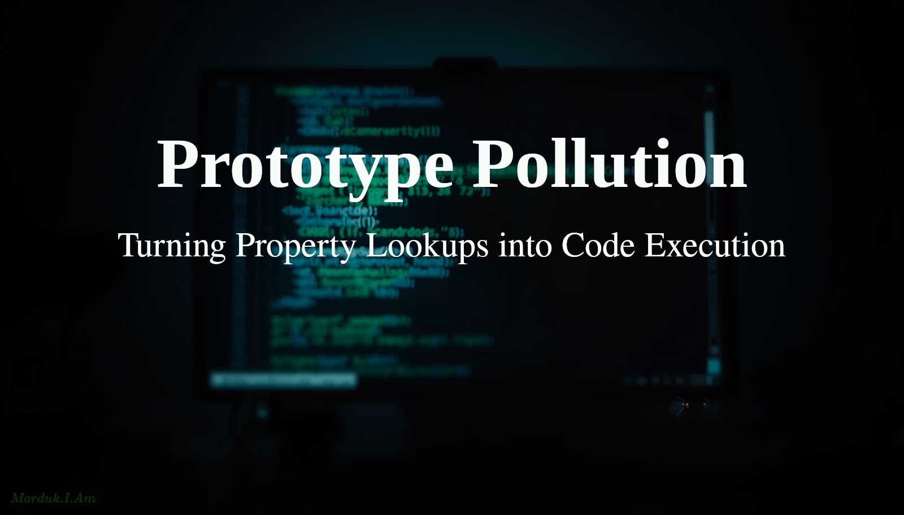

#   Prototype Pollution: Turning Property Lookups into Code Execution



The previous writeup, [location-href-navigation-xss](https://github.com/Marduk-I-Am/web-security-notes/blob/main/xss/location-href-navigation-xss.md), covers `location.href` as a sink you assign to directly. This time, we’re going one level deeper. What happens when you *can’t* touch the sink, but you can still control what flows into it?

If you can't directly assign to `location.href`, but you can modify a property on `Object.prototype` that some framework later reads when deciding where to navigate, is that still a navigation sink? What changed?

Short answer: Yes. Indirectly.

Long answer: This is where things get interesting. 

##  The Building Block

Consider the following code:
```javascript
const config = {};
console.log(config.redirectUrl);
```

- `config` - is an empty object literal and has no redirectUrl property

What does `console.log` print? Why does it matter for what we're about to cover?

`console.log` will **not** print an error. It will, however, return ***undefined***. JavaScript doesn't throw an error when you access a missing property. It walks up the prototype chain looking for it. When it reaches `Object.prototype` and doesn't find it there either, it returns undefined.

Now consider this:
```javascript
Object.prototype.redirectUrl = 'javascript:alert(1)';

const config = {};
console.log(config.redirectUrl);
```

`config.redirectUrl` doesn't exist on `config`. Same as the previous code, the engine looks up the chain and finds it on `Object.prototype`. The one you just polluted. This time it returns `javascript:alert(1)`.

This is prototype pollution. You're not injecting into the sink. You're injecting into the **lookup** that feeds the sink.

Going forward there are three terms you need to be familiar with:
- **Prototype pollution** - writing an attacker-controlled property onto Object.prototype (or another prototype high in the chain), so that all objects that inherit from it appear to have that property.
- **Gadget** - existing, legitimate application code that reads from a property that can be polluted, then does something dangerous with the value. The gadget is not malicious code you inject. It's code that was already there, waiting to be aimed. A gadget bridges pollution to execution.
- **Pollution sink** - a gadget that bridges all the way to a dangerous outcome: code execution, navigation to `javascript:`, `innerHTML` assignment, `eval`, etc.

Simply put. You pollute `Object.prototype` ➡️ A gadget reads the poisoned property ➡️ The gadget passes it to a sink ➡️ XSS fires. You never touch the sink directly.

##  Exercise 1: Spot the gadget

Consider the following code. A framework initialization pattern.
```javascript
function initRouter(userConfig) {
  const config = Object.assign({}, userConfig);

  const destination = config.redirectOnLoad || '/dashboard';

  if (destination) {
    location.href = destination;
  }
}

initRouter({});  // called with an empty config
```
Under normal conditions:
- `config.redirectOnLoad` is undefined. It's not set on `userConfig` and not on `Object.prototype`.
- The destination becomes `'/dashboard'` via the `||` fallback.
- The user lands on `/dashboard`. 

That is its intended behavior.

However, if the attacker is able to write to `Object.prototype.redirectOnLoad` and set it to `'javascript:alert(1)'`:

- The **gadget**, `const destination = config.redirectOnLoad || '/dashboard'`, reads the polluted property and feeds it toward the **sink**, `location.href = destination`.
- The destination is now `'javascript:alert(1)'` The `||` fallback never fires because the value is truthy, `destination = 'javascript:alert(1)'`.
- Causing XSS to fire.

  📓 **NOTE:** The `if (destination)` actually helps the attacker. If the check wasn't there, undefined with no navigation, the truthy check lets the polluted value through.

##  The Three Vectors

Now, the practical question, how does an attacker write to `Object.prototype` in a real app? An attacker can't just type `Object.prototype.redirectOnLoad = 'javascript:alert(1)'` in the browser console and call it a day. That only affects their own session. 

To affect ***other*** users, they need to find a vulnerable code pattern somewhere in the application.

It requires finding a code path that merges attacker-controlled JSON into an object without sanitizing the key `__proto__`.

Look for code that:

1. Takes user-supplied JSON (from a form, API request, URL parameter, etc.)
2. Merges that JSON into an existing object without checking the property names

### Vector 1: Deep *Merge* Functions

Deep merge functions copy properties from a `source` object into a `target` object. This is the most common way prototype pollution happens and why I will cover it more in depth.
```javascript
function merge(target, source) {
  for (let key in source) {
    if (typeof source[key] === 'object') {
      merge(target[key], source[key]);
    } else {
      target[key] = source[key];
    }
  }
}
```

Why is this vulnerable?

The function doesn't check what `key` is. It happily copies **any** property name from `source` into `target`. Most property names are harmless strings like `"name"` or `"age"`. But one property name is not harmless: `"__proto__"`.

Most property names write to the object itself. But `__proto__` often writes to `Object.prototype`. The blueprint that all objects inherit from.

Look what happens when an attacker sends:
```javascript
merge({}, JSON.parse('{"__proto__": {"redirectOnLoad": "javascript:alert(1)"}}'));
```

The function loops once: `key = "__proto__"`. Since `source["__proto__"]` is an object, the function recurses. Calling itself with `target["__proto__"]` and `source["__proto__"]`.

Inside that recursive call, the assignment becomes:
```javascript
target["__proto__"]["redirectOnLoad"] = "javascript:alert(1)";
```
But `target["__proto__"]` points to `Object.prototype`.

So you're actually writing:
```javascript
Object.prototype.redirectOnLoad = "javascript:alert(1)";
```

**Now every object in the application has `redirectOnLoad`!**

### Vector 2: `$.extend(true, {}, userInput)` in jQuery

This is the deep merge path in jQuery that was famously vulnerable to this. [CVE-2019-11358](https://nvd.nist.gov/vuln/detail/CVE-2019-11358) is a vulnerability in jQuery versions before 3.4.0 that allows for prototype pollution.

### Vector 3: Property Path Setters

These are utilities that let you set a property by path string, like `_.set(obj, '__proto__.isAdmin', true)` in older versions of lodash. The path traversal walks through `__proto__` and writes to the prototype.

##  Exercise 2: Will this pollute?

In the following code, what do lines A and B print? Has `Object.prototype` been polluted?
```javascript
const payload = JSON.parse('{"__proto__": {"evil": "javascript:alert(1)"}}');
console.log(payload.evil);  // line A

const obj = {};
console.log(obj.evil);  // line B
```

Neither line will print `'javascript:alert(1)'`, and `Object.prototype` has ***NOT*** been polluted.

`JSON.parse` with a `__proto__` key does not traverse the prototype chain. The JSON parser creates a plain object with a key literally named `__proto__` as an *own property*. It doesn't interpret it as the prototype accessor. So `payload.__proto__` is actually a regular property on `payload`, ***NOT*** `Object.prototype`.

This is a **crucial distinction**. Pollution requires a code path that uses bracket notation assignment (`obj[key] = value`) with attacker-controlled keys, in a context where `__proto__` triggers the prototype accessor. `JSON.parse` alone is safe. 

The danger is what the application does with the parsed JSON. If it passes it into a vulnerable merge function, that's when pollution occurs.

So the attack chain requires two ingredients: attacker-controlled JSON that reaches a vulnerable merge or setter.


##  Summary

Prototype pollution turns a lookup into a weapon. You don't inject the sink. You inject the property that the gadget reads. The attack chain is:

1. **Pollute** — Find a vulnerable merge or setter that writes to `Object.prototype` via `__proto__`
2. **Gadget** — Wait for existing code to read that polluted property
3. **Sink** — Watch that value reach `location.href`, `eval`, `innerHTML`, or similar

The browser doesn't know the difference between a real property and an inherited one. Neither does your framework. That's what makes this attack so effective. It uses the application's own code against itself.

##  Practice

If you would like to put this information into practice, try these free **[Portswigger](https://portswigger.net/)** labs:
- **[DOM XSS via client-side prototype pollution](https://portswigger.net/web-security/prototype-pollution/client-side/lab-prototype-pollution-dom-xss-via-client-side-prototype-pollution)** - directly demonstrates the merge-to-gadget-to-sink chain
- **[Client-side prototype pollution via flawed sanitization](https://portswigger.net/web-security/prototype-pollution/client-side/lab-prototype-pollution-client-side-prototype-pollution-via-flawed-sanitization)** - shows that the `__proto__` string itself can be filtered

---

*Marduk-I-Am*  
Web Security Notes  

GitHub: https://github.com/Marduk-I-Am