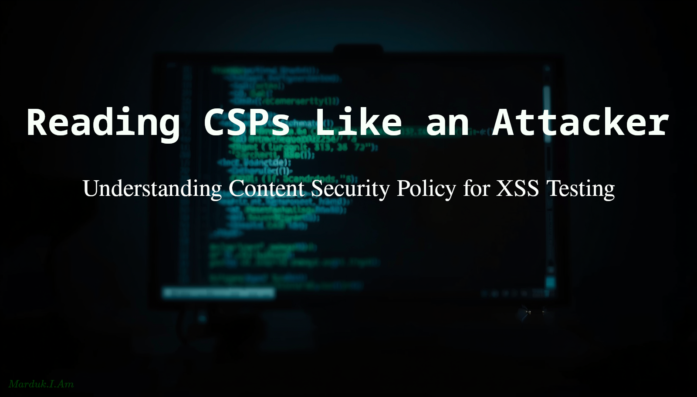
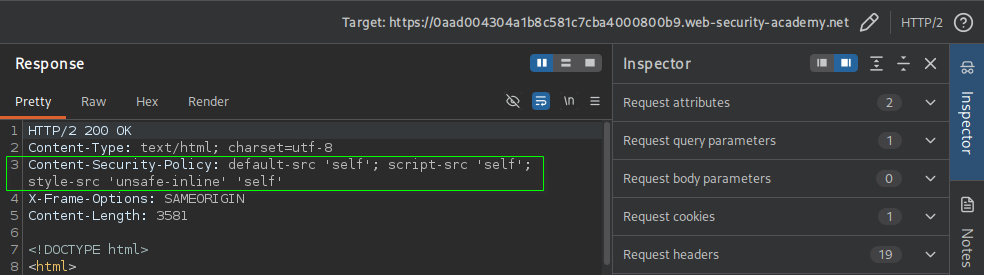
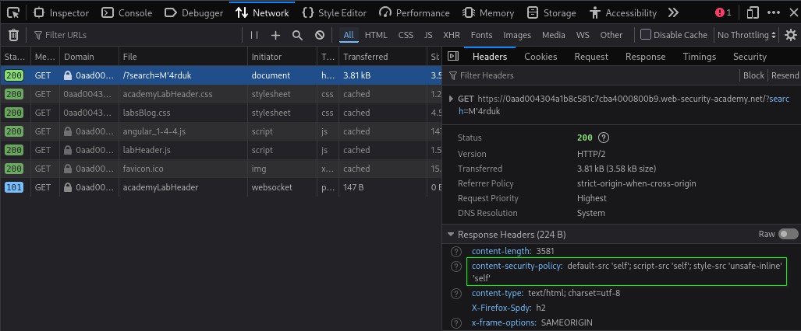

#   Reading CSPs Like an Attacker: Understanding Content Security Policy for XSS Testing



This article isn't about configuring CSPs. It's about understanding what a policy means during XSS testing and how to quickly identify potential attack paths.

##  Step 1: What CSP is and how to read a policy

Content Security Policy (CSP) is an HTTP response header. The server sends it, the browser enforces it. It tells the browser: *for this page, here are the rules about what content is allowed to load and execute*. The browser checks every resource and script against those rules before allowing it.

The header looks like this in an HTTP response:
```text
Content-Security-Policy: default-src 'self'; script-src 'self' https://cdn.example.com; img-src *
```

It's a semicolon-separated list of directives. Each directive controls a specific resource type.
The ones you'll encounter most often on real targets:
```text
default-src     — fallback for any resource type not explicitly listed
script-src      — controls what JavaScript is allowed to execute
style-src       — controls CSS
img-src         — controls images
connect-src     — controls fetch, XHR, WebSocket destinations
frame-src       — controls iframes
base-uri        — controls what <base href> can be set to
report-uri      — where the browser sends violation reports (not a restriction)
```

For XSS purposes, `script-src` is the directive you care about most. If `script-src` isn't present, `default-src` applies as the fallback. Everything else is secondary until you've assessed those two.

---

### How to find the policy on a real target

You can find the CSP in three places. Check in this order:
1. Response headers in Burp - load the target's main page, find the request in HTTP history, look at the response headers. Content-Security-Policy will be there if it exists. This is the most reliable method.


2. DevTools Network tab - click the main document request, Headers panel, scroll to Response Headers.


3. In the page source — some sites deliver CSP via a <meta> tag instead of a header:
    ```html
    <meta http-equiv="Content-Security-Policy" content="default-src 'self'">
    ```
    Less common but worth checking if the header isn't present.
    
    📓 **NOTE:** `<meta>` CSP has limitations. It can't use frame-ancestors or report-uri, and it can be bypassed by injecting a new `<meta>` tag before it in some cases.

---

### Reading a policy fast: the 60-second method

When you see an unfamiliar policy, read it in this order:

1.  Is `script-src` present?  
    If **yes**, that's your scope.  
    If **no**, look at `default-src`.

2.  What source values are listed?  
    The ones that matter:
    ```text
    'self'                  — same origin only
    'unsafe-inline'         — inline scripts and event handlers allowed
    'unsafe-eval'           — eval(), setTimeout(string), etc. allowed
    'nonce-abc123'          — only scripts with nonce="abc123" allowed
    'sha256-<hash>'         — only scripts matching this hash allowed
    https://cdn.example.com — scripts from this specific host allowed
    https:                  — scripts from any HTTPS source allowed
    *                       — anything allowed (policy is useless for this directive)
    ```
3.  Check for `base-uri`.  
    If it's missing or set to `*`, that's an immediate investigation point regardless of how tight `script-src` is.

4.  Paste the full policy into [Google CSP Evaluator](https://csp-evaluator.withgoogle.com/). It flags known weaknesses automatically.  
    Use it as a second pass, not a first pass. You want to read it yourself first so you understand what you're looking at.

##  Step 2: What CSP blocks, and what it doesn't

The mistake people make with CSP is treating it as a binary. Either present or absent, safe or unsafe. It's not. CSP is a set of **independent** restrictions, and most real-world policies block some attack vectors while leaving others wide open. Your job is knowing exactly where the line is for any given policy.

Let's build this precisely, directive value by directive value.

---

### `'unsafe-inline'`: what it actually permits

We've already identified this one, but let's be precise about scope, because it's commonly misunderstood.

`'unsafe-inline'` in `script-src` permits:
```html
<script>alert(1)</script>          ← inline script tags
     ← inline event handlers
<a href="javascript:alert(1)">     ← javascript: URIs in some browsers
```

It **does not** permit loading external scripts from arbitrary domains. That's a separate restriction controlled by the host list. A policy can have `'unsafe-inline'` ***and*** still block `<script src="https://evil.com/x.js">` if `evil.com` isn't whitelisted.

This matters because of a specific scenario. If you find reflected XSS and the policy has `'unsafe-inline'` but a tight host whitelist, you don't need a whitelisted host at all. You just write your payload inline. The host whitelist is irrelevant to you in that case.

---

### `'unsafe-eval'`: narrower than people think

`'unsafe-eval'` permits:
```javascript
eval("alert(1)")
new Function("alert(1)")()
setTimeout("alert(1)", 0)     // string form
setInterval("alert(1)", 0)    // string form
```

It **does not** permit inline `<script>` tags or external script loading. Those are governed independently. `'unsafe-eval'` only matters if your injection point is specifically a string that reaches one of those four function families. This is rare for direct injection, but extremely common as the sink in a DOM XSS or prototype pollution gadget chain.

You probably won't use `eval()` directly in a reflected XSS payload (try it though). What `'unsafe-eval'` tells you is: **DOM XSS sinks that use eval-like functions are exploitable**.

This matters when:
- You find a gadget chain (e.g., prototype pollution that eventually calls `eval()`)
- You control part of a string passed to `setTimeout(string)`
- The app uses template literals or dynamic function construction

Without `'unsafe-eval'`, these sinks are dead ends. With it, they're valid exploit paths.

The takeaway: `'unsafe-eval'` doesn't give you an immediate win, but it expands your attack surface significantly for more complex bugs.

---

### Nonces

A nonce is a one-time random value generated by the server and attached to trusted scripts:
```html
<script nonce="abc123">
```

When `script-src` contains `'nonce-abc123'` only scripts carrying that nonce execute. Unlike host allowlists, nonces authorize specific script tags rather than entire domains.

For an attacker, the first question is whether the nonce is predictable, reusable, exposed in the DOM, or obtainable through another vulnerability. A properly implemented random nonce is one of the strongest CSP defenses you'll encounter, which is why many CSP bypass techniques focus on reusing trusted scripts rather than defeating the nonce directly.

---

### CSP in Practice 1

Consider the following CSP:
```text
Content-Security-Policy: default-src 'self'; script-src 'self' 'unsafe-inline' https://apis.google.com; img-src *; report-uri /csp-report
```

- Can an attacker's injected inline `<script>alert(1)</script>` execute?  
**Yes**. `'unsafe-inline'` is present in `script-src`. Inline scripts are fully permitted. This CSP provides zero protection against basic XSS. Finding `'unsafe-inline'` in a traditional `script-src` policy usually means the CSP provides little or no protection against classic reflected or stored XSS.

- Can an attacker load a script from `https://evil.com/payload.js`?  
**No**. `script-src` only allows `'self'` and `https://apis.google.com`. `evil.com` is not listed. The browser blocks it.

- Can an attacker load a script from `https://apis.google.com/anything`?  
**Yes**. And this matters. `https://apis.google.com` is whitelisted as a host. Any path under that host is permitted. If there's a JSONP (JSON with Padding) endpoint, an open redirect, or any attacker-influenced response at any URL under `apis.google.com`, it's a bypass candidate. Whitelisted hosts are always worth investigating.

What else can we learn from this CSP?

- The `report-uri` (or `report-to` in modern browsers) tells you, as an attacker, that violations are being logged and where the violation reports go. In other words, `report-uri` indicates the site has configured CSP violation reporting. Whether anyone is actively monitoring those reports is impossible to know from the policy alone.

    **Probe carefully!** Every blocked payload generates a report. On a bug bounty this is fine, but it's useful to know.

- In this CSP, base-uri is not defined. When base-uri is absent, the browser places no restrictions on `<base>` tags. That means an attacker who can inject HTML may be able to modify how relative URLs are resolved throughout the page.

    For example, injecting `<base href="https://evil.com/">` causes relative URLs to be resolved against `evil.com` instead of the site's original origin. Depending on how the application loads resources, this can create CSP bypass opportunities, particularly when scripts, stylesheets, or other resources are referenced using relative paths.

    📓 **NOTE:** A missing `base-uri` isn't automatically exploitable, but it's always worth investigating because it can weaken otherwise restrictive CSP configurations.

---

### Host allowlists: same-origin isn't automatically safe

`'self'` permits scripts from the same origin as the page. This sounds airtight, but it has a specific, well-known failure mode. 

If the application allows file uploads to a path under that origin, and the uploaded file can be served as JavaScript, `'self'` includes your uploaded payload.

For example, you encounter a site with this CSP:
```text
Content-Security-Policy: script-src 'self'
```

Your next moves should be:
1. Find a file upload feature (avatar, document, attachment)
2. Upload a file containing: `alert(1)`  
       named something like: `payload.js`
3. Find the URL it's served from: typically `/uploads/<filename>` or similar
4. If that URL shares the same origin as the page, `'self'` permits it
5. Inject: `<script src="/uploads/payload.js"></script>`

This is a very common real-world bypass and worth checking on every target where `'self'` is the only `script-src` value **and** a file upload feature exists.

Make sure the uploaded file is served from the same origin and returned with a JavaScript-compatible content type.

---

### CSP in Practice 2: wildcards in subdirectives

Consider the following CSP:
```text
Content-Security-Policy: script-src https://*.example.com
```

- Does `https://app.example.com/script.js` match this policy?  
**Yes**. `*.example.com` matches any subdomain.

- Does `https://example.com/script.js` (no subdomain) match?  
**No**. This trips some people up. The wildcard `*.example.com` matches subdomains specifically, not the bare domain. `example.com` itself (no subdomain) is not covered by this pattern. You'd need `example.com` listed separately for that to work.

- Does `https://evil.com/script.js?redirect=https://app.example.com` match?  
**No**. CSP matches against the origin of the script's URL, not query parameters or path content. evil.com is the origin here regardless of what's in the query string. The whitelist check happens before the browser even looks at the redirect target.

- If you control a subdomain takeover on `https://abandoned.example.com`, does that help you?  
**Yes**. This helps directly and significantly. A subdomain takeover under `*.example.com` means you now control a domain that's **fully whitelisted**. Any script you host there executes. This is one of the highest-value findings in CSP bypass hunting. If you find a dangling DNS record on a subdomain that's covered by a wildcard `script-src`, you have a complete bypass.

##  Conclusion

Content Security Policy isn't something you glance at and classify as "good" or "bad." Every policy creates a different set of restrictions, and your job as a tester is understanding exactly where those restrictions begin and end.

When you encounter a CSP during an XSS assessment, focus on the questions that matter:

- Is `script-src` present?
- Are inline scripts allowed?
- Are eval-like functions permitted?
- Are nonces or hashes in use?
- Which hosts are trusted?
- Is `base-uri` restricted?
- Are there wildcard domains or other obvious attack surfaces?

A CSP should never be treated as a reason to stop testing. Instead, treat it as another piece of reconnaissance data. The policy tells you what the browser will allow, what it will block, and often where you should focus your efforts next.

---

*Marduk-I-Am*  
Web Security Notes  

GitHub:
https://github.com/Marduk-I-Am