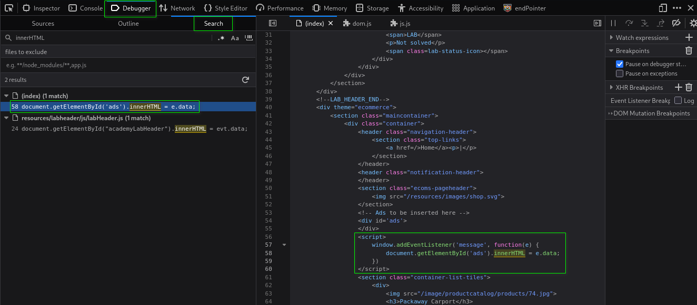

#   Reading JS Files Like an Attacker: Three Sources Still Worth Knowing


In my earlier articles on DOM XSS, I focused heavily on sinks: the dangerous functions and properties where attacker-controlled data can eventually become executable HTML or JavaScript.

But a DOM XSS requires two sides of the equation: **Source** --> **Sink**

The sink is where the dangerous operation occurs. The source is where the attacker-controlled data comes from.

When analyzing JavaScript, it's easy to focus on familiar sources such as `location.hash` and `location.search` and overlook other ways data can enter an application. This article looks at three sources that are particularly interesting to a bug bounty hunter:

- `document.referrer`
- `window.name`
- `window.postMessage`

Each works differently. `document.referrer` gets its value from the navigation that brought the user to the page. `window.name` can carry state between navigations. `window.postMessage` provides an intentional mechanism for cross-origin communication.

The goal isn't to understand every line of a JavaScript file. It's to recognize these sources when you encounter them, understand how an attacker might influence them, and then trace where that data goes.

##  🔎 `document.referrer` → Navigation Source

[`document.referrer`](https://developer.mozilla.org/en-US/docs/Web/API/Document/referrer) contains the URL of the previous page the user navigated **from** to the current one. The browser determines this value and may also send the corresponding value in the HTTP `Referer` header.

📓 **NOTE:** The header itself (`Referer`) is famously misspelled in the HTTP spec, but the JS property `document.referrer` is spelled correctly.

Unlike `location.hash` or `location.search`, an attacker can't just hand someone a URL with the payload baked in. The value comes from **where** the visitor came from, not the URL they're currently looking at. That makes exploitation slightly different.

Historically, an attacker could control a page that linked or redirected to the target, and place a payload in the referring URL. If the browser sent that full URL as the `Referer` header, the payload could then become available through `document.referrer` on the target.

Modern browser behavior, however, makes this considerably more difficult. `document.referrer` exploitation depends **heavily** on the attacker's [`Referrer-Policy`](https://developer.mozilla.org/en-US/docs/Web/HTTP/Reference/Headers/Referrer-Policy), and modern default browser behavior ([`strict-origin-when-cross-origin`](https://developer.mozilla.org/en-US/docs/Web/HTTP/Reference/Headers/Referrer-Policy#strict-origin-when-cross-origin_2)) often kills this attack before it starts.

As an attacker, your controlled site will generally need to be set to `Referrer-Policy: unsafe-url`. If `COOL-SITE-NAME.com` does not specify a `Referrer-Policy`, modern browsers use `strict-origin-when-cross-origin` as the default, which strips the path and query string from a cross-origin referrer, leaving `Referer: https://COOL-SITE-NAME.com/` with no payload.

So why should a hunter still care about `document.referrer`?

Because if the application actually uses `document.referrer` as trusted input and a full, attacker-controlled referrer can reach a dangerous DOM sink, the browser's protections don't matter anymore. The interesting question becomes whether you can construct a navigation where the payload survives the applicable referrer policy and reaches the sink.

If you find `document.referrer` being used, trace where the value goes. Look for flows into dangerous DOM sinks rather than assuming the source is exploitable on its own.

**Attacker's scenario:**
-   Vulnerable site - `VULNERABLE-SITE.com`
-   Attacker controlled site - `COOL-SITE-NAME.com`

1.  An attacker could host a redirect endpoint at `COOL-SITE-NAME.com/?q=` that immediately redirects the visitor to `VULNERABLE-SITE.com`.
2.  You get a text or an email from a 'friend' saying:
    ```text
    "check out this cute puppy pic!!"
    bit.ly/cute-puppy-pic
    ```
3.  You click on the link expecting to see a puppy, but are directed to `COOL-SITE-NAME.com/?q=` (shortened link expanded).
4.  The server immediately responds with a 301/302 redirect to `VULNERABLE-SITE.com`. No click needed.
5.  Because the navigation originated from `COOL-SITE-NAME.com/?q=`, the browser will use that page as the referrer, provided the applicable `Referrer-Policy` allows it.
6.  If the full URL is sent, the payload reaches `document.referrer`, where the vulnerable sink triggers the `alert(1)`.

📓 **NOTE:** This is why `document.referrer` labs are hard to build authentically. You need an actual second page or endpoint that causes navigation to the target, hosted somewhere, for the browser to set a real value.

##  🔎 `window.name` → Persistent Source

`window.name` is unique among DOM XSS sources for one specific reason: historically, it persisted across page navigations, even cross-origin ones, within the same browser tab.

Unlike sources such as `location.hash`, `location.search`, and `document.referrer`, which are tied to the current navigation or document, `window.name` survived the navigation itself. If you set it on one page and then navigated the same tab to a completely different origin, the value remained available to the new page's JavaScript.

That persistence is exactly what makes `window.name` interesting for attackers. It's a way to smuggle data across origins without needing `postMessage`, cookies, or any other cross-origin communication mechanism. The browser just... carries it along for you.

Modern browsers are increasingly clearing `window.name` on cross-origin navigations, making it less useful for cross-origin smuggling. Since browser support for this has been patchy and keeps changing, don't rely on a fixed rule. Test it live in the target browser to see what actually sticks.

So why should a hunter still care about `window.name`?

Unlike `document.referrer`, there is no site-controlled header equivalent to `Referrer-Policy` that determines whether an attacker-controlled `window.name` value is carried across a navigation. So the **mitigation burden sits almost entirely on developers**, not the browser.

If you find `window.name` being used, trace where the value goes. Developers may treat it as trusted temporary state without considering that it can be attacker-controlled. Look for flows from `window.name` into dangerous DOM sinks such as `innerHTML`, `outerHTML`, `insertAdjacentHTML()`, or script-execution contexts.

**Attacker's scenario:**
-   Vulnerable site - `VULNERABLE-SITE.com`
-   Attacker controlled site - `COOL-SITE-NAME.com`

1.  Attacker hosts `COOL-SITE-NAME.com` and sets `window.name = '<payload>'` via JavaScript
2.  Navigate the victim in the **same tab** to `VULNERABLE-SITE.com`. To do this the attacker's page must use one of these methods, as browser behavior varies:
    -   Use a plain `<a href="https://VULNERABLE-SITE.com">` link and rely on the victim clicking it (user-initiated navigation).
    -   Use `window.open('https://VULNERABLE-SITE.com', '<payload>')` - the second argument sets the `window.name` before the navigation even starts.
3.  `VULNERABLE-SITE.com`'s vulnerable code reads `window.name`, trusting it as if it were local/safe data
4.  `'<payload>'` execution occurs in `VULNERABLE-SITE.com`'s origin

##  🔎 `window.postMessage` → Cross-Origin Source

The internet relies on the [**Same-Origin Policy**](https://developer.mozilla.org/en-US/docs/Web/Security/Defenses/Same-origin_policy) (SOP), a critical security rule that prevents a malicious website from reading private data from your bank's website while you have it open in another tab.

Historically, this strict rule also prevented legitimate communication between different domains. Before `postMessage`, developers used insecure and hacky workarounds. Like `window.name`.

[`window.postMessage`](https://developer.mozilla.org/en-US/docs/Web/API/Window/postMessage) is basically a way for different browsing contexts to communicate with each other (commonly used for embedded widgets, authentication popups, and cross-domain iframe messaging). `postMessage` doesn't really "break" SOP. It provides a **controlled mechanism** for cross-origin communication that SOP otherwise prevents.

Let's see how it works.

### Practice Lab:

Go to this [PortSwigger lab](https://portswigger.net/web-security/dom-based/controlling-the-web-message-source/lab-dom-xss-using-web-messages). It's specifically designed to have readable JS with a real DOM XSS vulnerability. Don't try to solve it yet, just:
- Open the lab, click around to explore
- Open **DevTools** --> **Debugger** --> **Sources**: view the site's JS files
- **DevTools** --> **Debugger** --> **Search**: individually search for `location`, `message`, and `innerHTML`



Notice this finding, in the Page Source (index), when searching for `innerHTML`. This is what you are looking for:
```javascript
<script>
    window.addEventListener('message', function(e) {
        document.getElementById('ads').innerHTML = e.data;
    })
</script>
```

This is a textbook DOM XSS via `window.postMessage`.

What you're looking at:
- `window.addEventListener('message', ...)` - this is the source. The page is listening for messages sent from other windows via the `postMessage` API.
- `e.data` - that's the content of the message. If an attacker can send a `postMessage` to this page, they control `e.data`.
- `document.getElementById('ads').innerHTML = e.data` - that's the sink. **No sanitization between source and sink**. Whatever arrives in `e.data` gets written directly as HTML.

This is the full chain in three lines. Source --> no sanitization --> sink. That's as clean as DOM XSS gets.

**Defensive Origin Check:**

Look at that event listener again. There's no origin check. A properly implemented `postMessage` handler should look like this:
```javascript
window.addEventListener('message', function(e) {
    if (e.origin !== 'https://trusted-site.com') return;
    document.getElementById('ads').innerHTML = e.data;
})
```

That origin check is the defense. Without it, any window, ***including one you control***, can send a message and have it written to `innerHTML`.

This is one of the most common `postMessage` DOM XSS patterns. Developers fail to validate `e.origin`, allowing an attacker-controlled window to supply `e.data`, which is then passed directly into an `innerHTML` sink.

As an attacker, look out for flawed origin checks. In real-world code, developers may use weaker checks like:
```javascript
if (e.origin.indexOf('trusted-site.com') > -1) { ... }
// Bypassable with: https://trusted-site.com.attacker.com

if (e.origin.includes('trusted-site.com')) { ... }
// Bypassable with: https://attacker-trusted-site.com

if (e.origin.endsWith('trusted-site.com')) { ... }
// Bypassable with: https://attackertrusted-site.com
```

If you see any of these patterns, you can spin up a domain that contains the trusted string and bypass the check entirely. A strict `===`/`!==` comparison against the exact expected origin is the safest and simplest approach.

**Lab Solution:**

In order to solve the lab, you need to load the target in an `<iframe>` and send it a `postMessage` containing the payload.
```html
<iframe src="https://YOUR-LAB-ID.web-security-academy.net/" onload="this.contentWindow.postMessage('','*')">
```

- `src=` - that's the target. The vulnerable lab URL goes there. Just remember to change `YOUR-LAB-ID` to *your* unique ID in the lab's URL.
- `onload="this.contentWindow.postMessage()` - when *this* page (`<iframe>`) loads, send the following message.
- `` - payload that calls the print function when it errors out.
- `*` - wildcard. `postMessage` in this example, `postMessage` takes two arguments. The first is the message, and the second specifies the target origin. Since there is not an origin check in the script, a wildcard can be used.

Once you have your payload, you can head over to the lab's Exploit Server and paste it into the Body section. Click '***Store***', then '***Deliver exploit to victim***' to solve the lab.

Here's how it can look in the real world.

**Attacker's scenario:**
-   Vulnerable site - `VULNERABLE-SITE.com`
-   Attacker controlled site - `COOL-SITE-NAME.com`

1.  Attacker sends shortened link --> victim clicks --> lands on `COOL-SITE-NAME.com`
2.  `COOL-SITE-NAME.com` never redirects the victim anywhere
3.  Behind the scenes, your page has an invisible (or disguised) iframe loading the real target
    ```html
    <iframe src="https://VULNERABLE-SITE.com/" onload="this.contentWindow.postMessage('','*')">
    ```
4.  Attacker's page messages the payload into that iframe automatically via `onload`
5.  Execution happens inside the iframe, in the `VULNERABLE-SITE.com`'s origin

Unlike `document.referrer` and `window.name`, `postMessage` isn't an accidental cross-origin data channel. It was specifically designed to enable cross-origin communication. The vulnerability comes from trusting messages that should not have been trusted.

##  Conclusion

When you open a JavaScript file, resist the urge to scan only for `location.hash` and `location.search`. Broaden your search. Use DevTools' global search to look for:
- `referrer`
- `window.name` (or just `.name` in context)
- `addEventListener('message')`
- `onmessage`
- `postMessage`

Once you find a usage, trace the data flow. Ask yourself three questions:

1.  **Where does this value come from?** - Is it attacker-controllable?
2.  **How does it get processed?** - Is it parsed, validated, or sanitized?
3.  **Where does it ultimately go?** - Does it end up in `innerHTML`, `eval()`, `document.write()`, or another sink?

The answer to all three questions determines whether you have a vulnerability or a dead end.

You don't need advanced tooling to spot these sources. The **DevTools Search** tab (Ctrl+Shift+F) across all loaded scripts is your best friend. For more advanced hunting, PortSwigger's DOM Invader (built into Burp's browser) can automatically track tainted data from sources to sinks, highlighting potential XSS in real-time. But remember: tools are accelerators, not replacements. Understanding the underlying flow is what turns a tool alert into a critical-severity report.

### Final Thought

Every DOM XSS shares the same anatomy. A ***source*** provides the knife, a ***sink*** makes the cut. Your job as a hunter is to spot the handoff between them. The moment untrusted data crosses the line into executable code.

`document.referrer`, `window.name`, and `window.postMessage` are just three examples of sources that are often overlooked. But the principle applies universally. Any data that enters your application from an untrusted source is suspect. Treat it as such, trace it relentlessly, and you'll find the bugs others missed.

Now go read some JavaScript—and think like an attacker.

---

*Marduk-I-Am*  
Web Security Notes  

GitHub:  
https://github.com/Marduk-I-Am